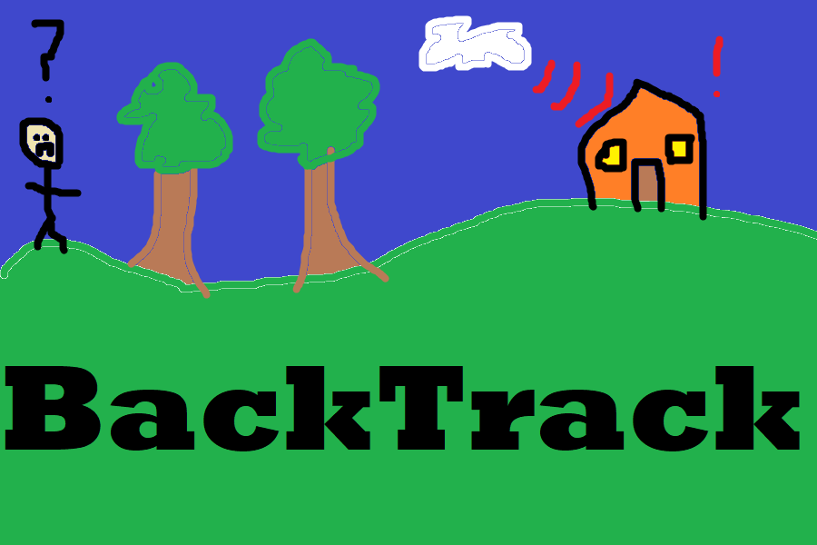

# BackTrack

This is a project developed for HackKU 2022 ([Devpost](https://devpost.com/software/backtrack-vd738u)).

Notify your emergency contacts if you don't make it home by the time you expect. Useful in a variety of emergency scenarios, from getting lost to car crashes.

Frontend app:
- React Native used for cross-compatability
- Developed on Android using expo
- Requests permissions and retrieves user contacts and location

Backend server:
- Node.js with Express framework
- SQLite3 database
- Twilio API for sending SMS messages

Stretch goals:
- Location tracking for automatic disarming
- Recurring times for automatic arming
- Calling landlines and WhatsApp messages